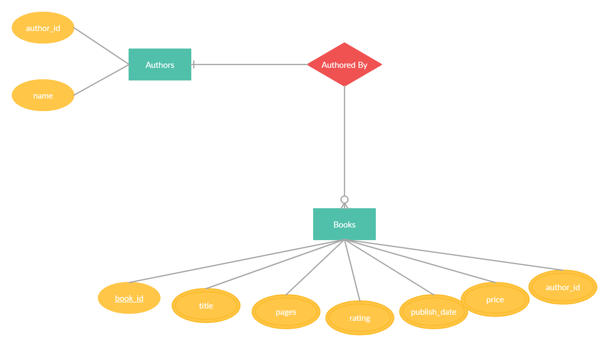

# Dev Environment Setup
1) Install Python from https://www.python.org/
2) Clone the repository
   ```bash
   git clone https://github.com/TheCez/books_info_api.git
   ```
3) install the requirements from root directory of cloned repository

   ```bash
   pip install -r requirements-local.txt
   ```
4) Run the app.py
   ```bash
   python app.py
   ```

# ER Diagram


# Database
Import the SQL File From [Here](Database/books_db.sql)

# Code Explanation
Please read the code explanation [Here](Code_Explanation/Code_Explanation.pdf)

# Deploy to Heroku
[](https://heroku.com/deploy?template=https://github.com/TheCez/books_info_api)


